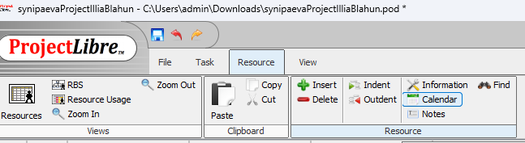

# 📁 ProjectLibre — Juhendite veebisait

Veebisait, mis selgitab samm-sammuliselt, kuidas kasutada **ProjectLibre** tarkvara — kalendrite loomine ja diagrammide vaatamine.[^1]

<!-- 📸 LISA SIIA PILT: screenshot peamisest lehest (kalender-juhend avatud brauseris) -->

---

## 📋 Sisukord

- [Mida projektis tehti](#mida-projektis-tehti)
- [Muudetud failid](#muudetud-failid)
- [Lisatud funktsionaalsused](#lisatud-funktsionaalsused)
- [Struktuur](#struktuur)
- [Kuidas on tehtud](#kuidas-on-tehtud)
- [Lehed](#lehed)
- [Tehtud tööd](#tehtud-tööd)
- [Autor](#autor)

---

## Mida projektis tehti

Loodi kahe lehega staatiline veebisait, mis õpetab kasutama **ProjectLibre** tarkvara:

1. Töökalendri loomine ja seadistamine
2. Gantt-diagrammi kasutamine
3. Resource Usage vaate kasutamine

---

## Muudetud failid

| Fail | Muudatus |
|------|----------|
| `index.html` | Loodud kalender-juhend (6 sammu) |
| `diagramm.html` | Loodud diagrammide juhend (4 sammu) |
| `style.css` | Kogu saidi kujundus |
| `projectLibreImg/` | Lisatud ekraanipildid sammude jaoks |

---

## Lisatud funktsionaalsused

### 📅 Kalender (`index.html`)
- Uue kalendri loomine ProjectLibre's
- Tööpäevade ja -aegade seadistamine
- Kalendri rakendamine projekti ülesannetele

### 📊 Diagrammid (`diagramm.html`)
- Gantt-diagrammi avamine ja kasutamine
- Resource Usage vaate avamine
- Ressursside koormuse jälgimine

---

## Struktuur

```
MC-project/
├── index.html          # Kalender-juhend (6 sammu)
├── diagramm.html       # Diagrammide juhend (4 sammu)
├── style.css           # Kogu saidi stiil
├── projectLibreImg/    # Pildid ProjectLibre juhenditele
│   ├── img1–img6.png   # Kalendri sammude pildid
│   ├── gantt1–2.png    # Gantt-diagrammi pildid
│   └── res1–2.png      # Resource Usage pildid
└── images/             # Muud pildid
```

---

## Kuidas on tehtud

### HTML

Kaks lehte — `index.html` ja `diagramm.html`. Mõlemal on sama struktuur:

- `<nav>` — kleepuv navigatsiooniriba koos aktiivse lehe märgistusega
- `<header>` — sinise gradiendiga pealkiri ja alapealkiri
- `<main>` — eesmärgi-kaart + sammude sektsioonid
- `<footer>` — autori nimi

Iga samm on eraldi `<section>` blokis:

```html
<section>
    <span class="step-label">Samm 1</span>
    <h2>Sammu pealkiri</h2>
    <p>Sammu kirjeldus.</p>
    
</section>
```

### CSS

Üks `style.css` fail mõlema lehe jaoks. CSS muutujad:

```css
:root {
    --blue: #0078d7;
    --blue-dark: #005a9e;
    --bg: #f0f4f8;
    --radius: 12px;
}
```

Kujunduse põhiomadused:
- Valged kaardid varjuga sammude jaoks
- Sinine gradient päises
- Kleepuv nav-riba (`position: sticky`)
- Responsive — mobiilil peidetakse logo

### Pildid

Kõik ekraanipildid on tehtud käsitsi ProjectLibre tarkvarast ja laetakse otse `` kaudu, ilma JavaScriptita.[^2]

---

## Lehed

| Leht | Sisu | Sammude arv |
|------|------|-------------|
| [`index.html`](index.html) | Töökalendri loomine ja seadistamine | 6 |
| [`diagramm.html`](diagramm.html) | Gantt-diagramm ja Resource Usage | 4 |

<!-- 📸 LISA SIIA PILT: mõlema lehe kõrvuti screenshot (desktop vaade) -->

---

## Tehtud tööd

- [x] `index.html` — kalender-juhend loodud
- [x] `diagramm.html` — diagrammide juhend loodud
- [x] `style.css` — kujundus valmis
- [x] Ekraanipildid lisatud `projectLibreImg/` kausta
- [x] Responsive disain mobiilile
- [ ] Ingliskeelne versioon
- [ ] Animatsioonid sammude vahel

---

> [!NOTE]
> Veebisait töötab ilma serverita — kõik failid on staatilised ja avatavad otse brauseris.

> [!TIP]
> Pildid peavad asuma `projectLibreImg/` kaustas, muidu ei kuvata neid lehel.

> [!WARNING]
> Ära muuda `style.css` muutujate nimesid — neid kasutatakse mõlemal lehel.

---

## Autor

© 2026 Illia Blahun

[^1]: Projekt on loodud õppeotstarbel ProjectLibre tarkvara tutvustamiseks.
[^2]: Pildid on tehtud Windows ekraanipildi tööriistaga ja salvestatud PNG formaadis.
